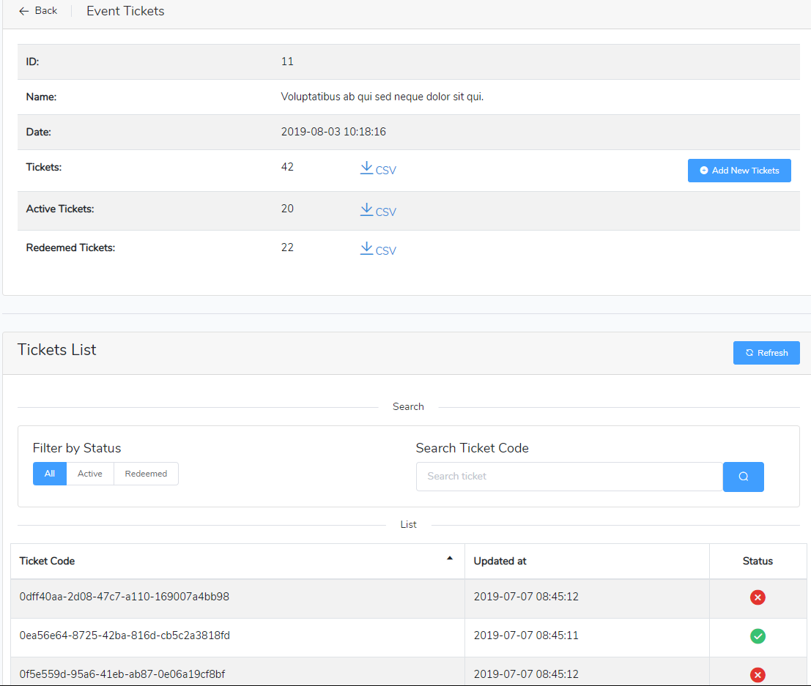
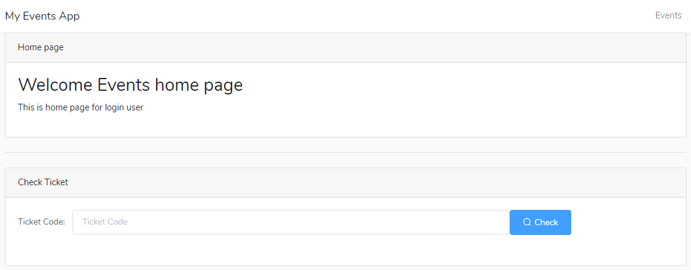
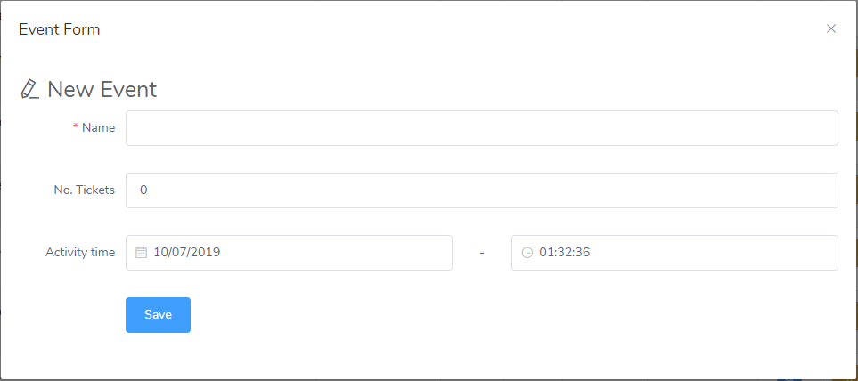
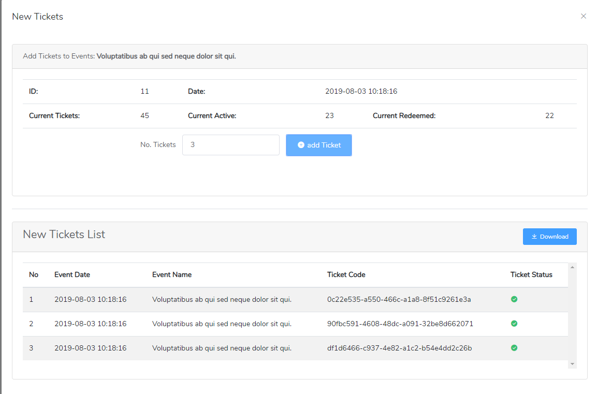
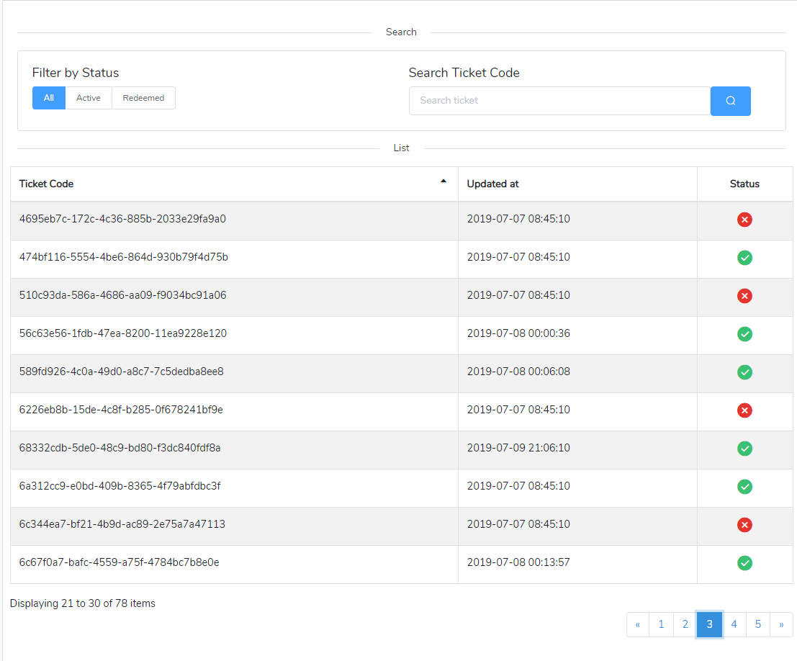
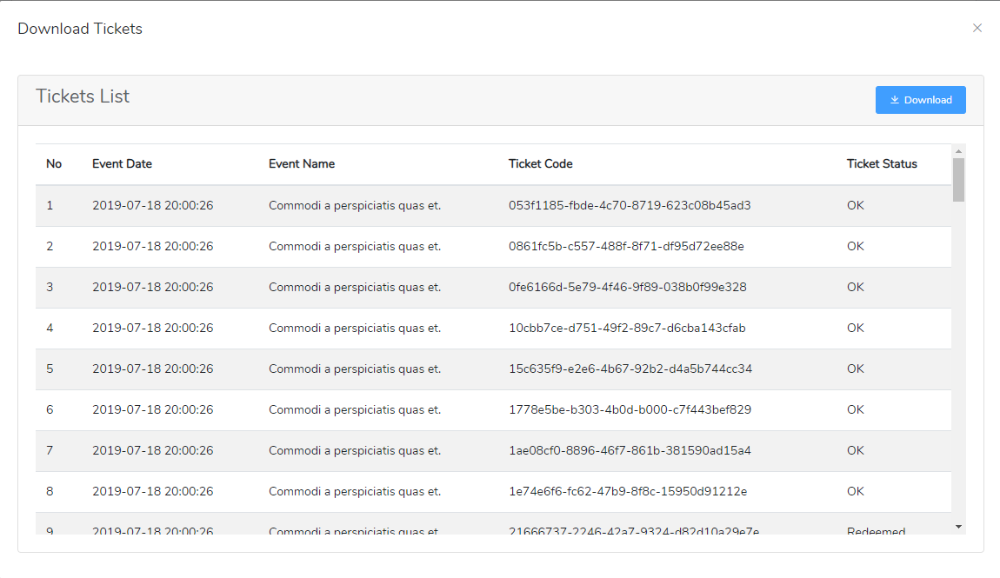

# Events-Tickets
This test is a simple rudimentary event ticket management solution. The overall
goal is to be able to create events and manage the number of people accessing each event. The project implement with Laravel 5.6  and VUE.js for UI.



## Specification
- The application should have a web page to create events. Each event should have a Name, Date and initial number of tickets.
- From the event page, the user should be able to see the total number of tickets and how many have been redeemed. The page should also contain a button to refresh the counters.
- Each ticket can be represented with a unique token.
- From the event page, the user should be able to download a CSV with all non-redeemed tickets.
- The user should be able to add more tickets to an event and get a download of the new tickets.
- The application should have a page where the user can check the status of a ticket. A ticket can either be ___redeemed___ or ___ok___.

## Frameworks
- Backend Laravel 5.6
- Frontend Vue.js with vue-router, Element UI components and vuetable-2 for Grid pagination

## Installation
1- run the following composer command to install Laravel
```  
    composer install
```
This will install all dependencies for laravel

2- Vue js Installation
run the following composer command to node models and vue js
```  
    npm install
```
If you use ```homestead``` on windows then use parameter ```--no-bin-links``` as the following:
```
    npm install --no-bin-links
```

3- Config Database:
create database and set up the connection and name in **.env** file
```
    DB_CONNECTION=mysql
    DB_HOST=127.0.0.1
    DB_PORT=3306
    DB_DATABASE=laravel-api
    DB_USERNAME=homestead
    DB_PASSWORD=secret
```
 
 4- open terminal in the root folder of project and Run Migration:
 ```$xslt
    php artisan migrate
```
This will create two database table __events__ and __events_tickets__ 

5- Run Seeds
```$xslt
    php artisan db:seed
```
This will insert fake data for the two tables

6- Run the project on browser
- Open your browser to project link 
- this will display the Home page with check ticket form
- From up right menu Click the __Events__ menu to go to the Events List page

That's it 

## Technical used for Ticket unique Token
For Ticket Token I use UUID from helper function in Laravel. Instead of auto increment integer primary key I use the UUID as primary key and Token for Tickets.
UUID stands for Universal Unique Identifier. It's a 128-bit number used to uniquely identify some object or in our case, a record in our database.

### Migration DB (Ticket)
By default, a Laravel migration includes a `$table->primary('id');` column in each migration you create.
Using UUIDs is as simple as updating our migration to use the `->uuid()` method that Laravel provides out of the box for us

```php
        Schema::create('events_tickets', function (Blueprint $table) {
            $table->uuid('ticket_id')->primary();
            $table->unsignedInteger('event_id');
            $table->boolean('status')->default(1); //1: OK , 0: redeemed
            $table->timestamp('created_at')->default(\DB::raw('CURRENT_TIMESTAMP'));
            $table->timestamp('updated_at')->default(\DB::raw('CURRENT_TIMESTAMP on update CURRENT_TIMESTAMP'));
            $table->foreign('event_id', 'fk_events_tickets_event_id')->references('event_id')->on('events')->onUpdate('CASCADE')->onDelete('CASCADE');
        });
```
The important line you should notice is this one: `$table->uuid('id')->primary();`.
**Notice** I'm using the `uuid()` method instead of the common `increments()` method. As you can see, the `uuid()` method specifies the column should be a __UUID__ equivalent column and I also specify that it should be the primary key on the table.

### Use Eloquent Model Events
Eloquent has what are known as Model Events. In total, it fires a total of 11 events in different scenarios. Our Ticket model could look like:

```php
    class Ticket extends Model
    {

    .....
    ......

    protected static function bootUsesUuid()
    {
        static::creating(function ($model) {
            if (! $model->getKey()) {
                $model->{$model->getKeyName()} = (string) Str::uuid();
            }
        });
    }

    public function getIncrementing()
    {
        return false;
    }

    public function getKeyType()
    {
        return 'string';
    }

    ......
    .......
```
Our Model has 3 methods in it. 
- The __boot method__ is where we can hook into our model and listen for any Eloquent events. 
- The __getIncrementing method__ is used by Eloquent to now if the IDs on the table are incrementing. Remember I'm using UUIDs so I set auto incrementing to `false`.
Lastly. 
- The __getKeyType method__ just specifies that the IDs on the table should be stored as strings.

In our boot method, we are listening for the creating Eloquent event. This even is fired just before the record is actually stored in the database. We hook into this event, and use the `uuid()` method provided by the `Str class` in Laravel.
As I final note, I use a PHP trait called __UsesUuid__ where I'll have the logic above. That way I wouldn't repeated the code on every model I wanted to use UUIDs.

This is what the __UsesUuid trait__ would look like:

```php
    namespace App\Models\Concerns;

    use Illuminate\Support\Str;

    trait UsesUuid
    {
        protected static function bootUsesUuid()
        {
            static::creating(function ($model) {
                if (! $model->getKey()) {
                    $model->{$model->getKeyName()} = (string) Str::uuid();
                }
            });
        }

        public function getIncrementing()
        {
            return false;
        }

        public function getKeyType()
        {
            return 'string';
        }
    }
```

Now, in any model that as the correct column in its migration I can simply use the __UsesUuid trait__ like so

```php
class Ticket extends Model
{
    use App\Models\Concerns\UsesUuid;

    protected $table = 'events_tickets';
    protected $primaryKey = 'ticket_id';
    public $timestamps = false;

    protected $fillable = ['event_id', 'status'];
    .....
    ......
}
```

## DB Structure
### events table
Field  | Type | Description
------------- | ------------- | -------------
event_id  | Integer | Primery key.
name  | varchar(255) | Event name.
event_date  | datetime | Event Datetime.
created_at  | timestamp | Event timestamp created.
updated_at  | timestamp | Event timestamp updated.

### events_tickets table
Field  | Type | Description
------------- | ------------- | -------------
ticket_id  | char(36) | Primery key use UUID.
event_id  | Integer | Foreign key eleted to events table.
status  | tinyint(1) | By default 1. 1:OK, 0:redeemed.
created_at  | timestamp | ticket timestamp created.
updated_at  | timestamp | ticket timestamp updated.

## API Routes paths

| path | methods | Description |
|:--------|:--------|:--------|
| /api/events | get | List of all Events, use paginate |
| /api/events/add-new | post | Add new Event |
| /api/events/{event_id}/update | post | Update target event with event_id |
| /api/events/{event_id}/add-tickets | post | Add amultiple Tickets releted for target event with event_id |
| /api/events/{event_id}/tickets | get | Return a list of ticket for target event with event_id, use paginate |
| /api/events/{event_id}/tickets/{type} | get | Return a list of ticket for target event with event_id. Type must be __ok__ or __redeemed__ or __all__ |
| /api/tickets/{ticket_id} | get | Return target ticket with UUID=ticket_id |
| /api/tickets/{ticket_id}/update | post | update target ticket with  UUID=ticket_id |


## Laravel: My PHP Folders & Files
### Models
- App\Models
    - __Event.php__ 
    - __Ticket.php__ 
    - Concerns
        - __UsesUuid.php__ 

### Controllers
- App\Http\Controllers\AP
    - __BaseController.php__ 
    - __EventsController.php__
    - __TicketsController.php__

### Requests
- App\Http\Requests
    - __EventRequest.php__ 

### Resources
- App\Http\Resources
    - __EventCollection.php__ 
    - __EventResource.php__ 
    - __TicketCollection.php__ 
    - __TicketResource.php__ 

## Screenshot
- __Home page__: include Check ticket that check if ticket is `OK` or `Redeemed`
    

- __Events List__: List of all events by paginate
    

- __Events Add__: Modal form for create new event
    
    
- __Events Add Tickets__: Modal form for create new event
    
    
- __Events Add__: Modal form for create new event
    
    
- __Tickets List__: List of all tickets that belong for target event. Use Pagination, sort and filters.
    

- __Tickets List Download__: List of all tickets which will be download as CSV.
    